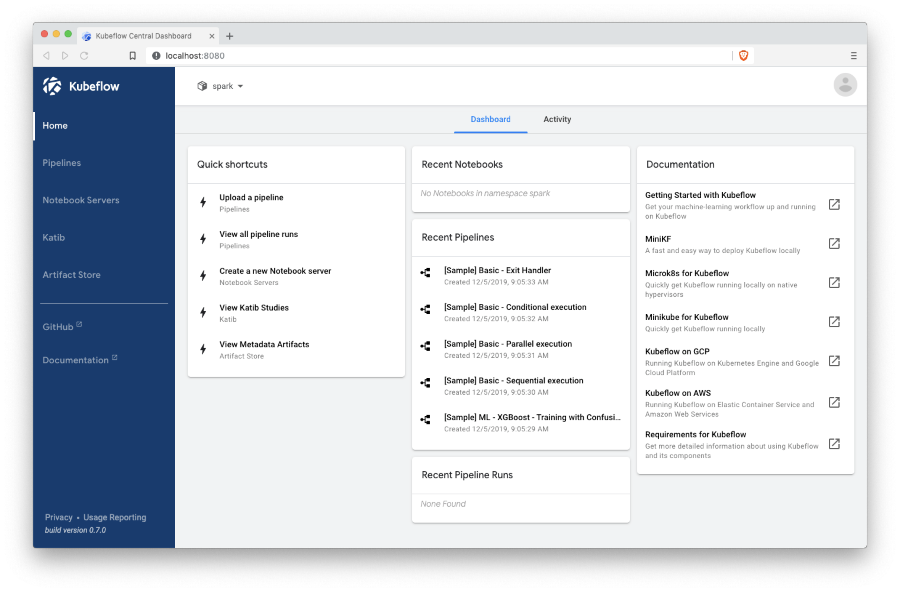
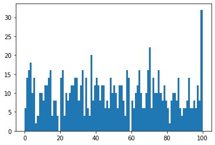

Kubeflow POC
---
# Installation
* run `install.sh`
* once completed, run `kubectl port-forward -n istio-system svc/istio-ingressgateway 8080:80`
* navigate to Kubeflow UI at [localhost:8080](http://localhost:8080)
* create namespace 'spark' in the create namespace dialog. Name 'spark' is important here because RBAC and resources from this repo use it (TODO: should be changed to context-based installation)

Expected result:



# Jupyter integration with Spark
* disable Istio sidecar injection by removing a label from the namespace `k label ns spark istio-injection-` ([kubeflow/issues/4306](https://github.com/kubeflow/kubeflow/issues/4306))
* verify namespace, configure roles, and install Jupyter from specs:
  ```
  kubectl apply -f specs/namespace.yaml
  kubectl apply -f specs/rbac.yaml
  kubectl apply -f specs/notebook.yaml
  ```
* verify notebook is up at [localhost:8080/_/jupyter/](http://localhost:8080/_/jupyter/)
* run examples and check executor pods are up and actually running tasks

## Examples
### Apache Toree kernel (Scala):
```
import org.apache.spark.{SparkConf, SparkContext}
import java.net._

val localIpAddress: String =  InetAddress.getLocalHost.getHostAddress

val conf = new SparkConf()
           .setAppName("Toree test")
           .setMaster("k8s://https://kubernetes.default.svc.cluster.local:443")
           .set("spark.driver.host", localIpAddress)
           .set("spark.kubernetes.namespace", "spark")
           .set("spark.kubernetes.container.image", "mesosphere/spark:2.4.3-bin-hadoop2.9-k8s")
val sc = new SparkContext(conf)
sc.parallelize(1 to 1000).sum
```
Expected output: `500500.0`

### PySpark:
```
import pyspark
from pyspark.sql import SparkSession
import socket
from operator import add

localIpAddress = socket.gethostbyname(socket.gethostname())

conf = pyspark.SparkConf().setAll([
    ('spark.master', 'k8s://https://kubernetes.default.svc.cluster.local:443'),
    ("spark.driver.host", localIpAddress),
    ("spark.kubernetes.namespace", "spark"),
    ("spark.kubernetes.container.image", "akirillov/spark:spark-2.4.3-hadoop-2.9-k8s")])

spark = SparkSession.builder.appName("PySpark").config(conf=conf).getOrCreate()
spark.sparkContext.parallelize(range(1, 1001)).reduce(add)
```
Expected output: `500500`

#### Plotting with matplotlib
```
import matplotlib.pyplot as plt

from random import seed
from random import randint

seed(1)
data = spark.sparkContext.parallelize(range(1, 1001)).map(lambda num: randint(0, 100)).collect()
plt.hist(data, bins=100)
```
Expected output:



# Tensorflow & Horovod
## Notebooks
* [commons](notebooks/commons.ipynb) - a notebook with helper methods. It should be uploaded together with other notebooks
* [MNIST Tensorflow](notebooks/MNIST%20Tensorflow.ipynb) - a vanilla Tensorflow example for MNIST
* [MNIST Horovod](notebooks/MNIST%20Horovod.ipynb) - MNIST training using Horovod with Tensorflow (local mode, CPU)
* [Horovod Spark](notebooks/Horovod%20Spark.ipynb) - a simple example of Horovod-Spark integration
* [MNIST Horovod Spark](notebooks/MNIST%20Horovod%20Spark.ipynb) - MNIST training using Horovod with Tensorflow for training and Spark for parallelization
* [MNIST Spark Horovod ETL-ML](notebooks/MNIST%20Spark%20Horovod%20ETL-ML.ipynb) - MNIST training using Spark to read the data and then pass to Tensorflow using Horovod for broadcasting variables


# Docker images
This repo contains the following Dockerfiles used in specs, examples, and notebooks:
* [Horovod](docker/horovod/Dockerfile) - installs Tensorflow, PyTorch, MXNet, and Horovod
* [Spark](docker/spark/Dockerfile) - builds on top of Horovod image and adds OpenJDK and Spark
* [Jupyter Notebook](docker/horovod/Dockerfile) - builds on top of Spark image and adds Jupyter

# Running Spark
## Running Spark from a pod

Create a service account and roles, run a pod based on a valid Spark image:
```
kubectl apply -f specs/rbac.yaml
kubectl run -it busybox --image=mesosphere/spark:2.4.3-bin-hadoop2.9-k8s --command bash --restart=Never --serviceaccount=spark-sa --rm
```

### spark-shell
```
/opt/spark/bin/spark-shell --master k8s://https://kubernetes.default.svc.cluster.local:443 \
--conf spark.driver.host=$(hostname -i) \
--conf spark.kubernetes.namespace=spark \
--conf spark.kubernetes.authenticate.driver.serviceAccountName=spark-sa \
--conf spark.kubernetes.container.image=mesosphere/spark:2.4.3-bin-hadoop2.9-k8s
```

### spark-submit (cluster mode)
```
/opt/spark/bin/spark-submit --master k8s://https://kubernetes.default.svc.cluster.local:443 \
--deploy-mode cluster \
--conf spark.kubernetes.namespace=spark \
--conf spark.kubernetes.authenticate.driver.serviceAccountName=spark-sa \
--conf spark.kubernetes.authenticate.submission.caCertFile=/var/run/secrets/kubernetes.io/serviceaccount/ca.crt \
--conf spark.kubernetes.authenticate.submission.oauthTokenFile=/var/run/secrets/kubernetes.io/serviceaccount/token \
--conf spark.kubernetes.container.image=mesosphere/spark:2.4.3-bin-hadoop2.9-k8s  \
--class org.apache.spark.examples.SparkPi \
local:///opt/spark/examples/jars/spark-examples_2.11-2.4.3.jar 1000
```

# TODO
* pass namespace, master, and pod IP to configuration automatically (https://kubernetes.io/docs/tasks/inject-data-application/environment-variable-expose-pod-information/#use-pod-fields-as-values-for-environment-variables)
